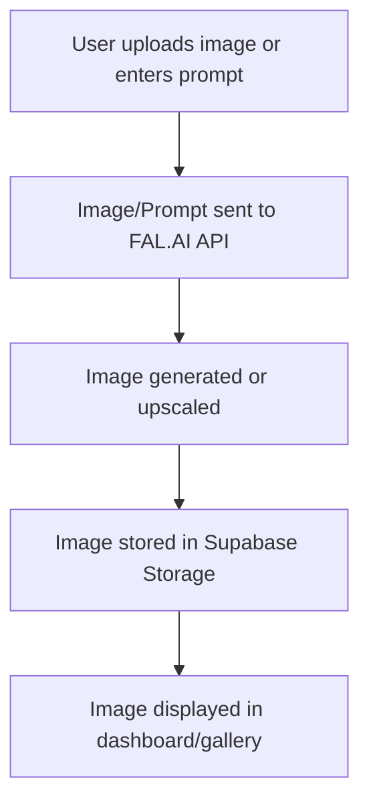

# aipic

<p align="center">
  <b>AI Image Generation & Upscaling Dashboard</b><br>
  <a href="https://github.com/vidmase/aipic/actions"></a>
  <a href="#license"></a>
</p>

---

## 🚀 Overview
A modern dashboard for AI-powered image generation and upscaling, built with Next.js, Supabase, and FAL.AI APIs. Easily generate images from text prompts, upscale images, and manage your creations in a beautiful, user-friendly interface.

---

## ✨ Features
- **Text-to-Image Generation** using FAL.AI
- **Image Upscaling** via FAL.AI /recraft/upscale/crisp
- **Albums & Gallery Management**
- **Supabase Storage** for uploads
- **Public/Private Image Access** with RLS policies
- **Responsive, Modern UI** with tooltips, previews, and categories
- **Edge-to-Edge Full-Size Image Dialog** with download
- **Fast LCP** with prioritized images

---

## 🛠️ Tech Stack
- Next.js (React)
- Supabase (Auth, Storage, RLS)
- FAL.AI APIs
- Tailwind CSS
- TypeScript

---

## ⚡ Getting Started
1. **Clone the repo:**
   ```bash
   git clone https://github.com/vidmase/aipic.git
   cd aipic
   ```
2. **Install dependencies:**
   ```bash
   npm install
   # or
   pnpm install
   ```
3. **Configure environment:**
   - Copy `.env.example` to `.env.local` and fill in your Supabase and FAL.AI credentials.
4. **Run locally:**
   ```bash
   npm run dev
   # or
   pnpm dev
   ```
5. **Build for production:**
   ```bash
   npm run build
   npm start
   ```

---

## 💡 Usage
- Visit `/dashboard` to generate or upscale images.
- Manage albums and view your creations in the gallery.
- Use the sidebar to switch between categories.

---

## 📈 How It Works


---

## 🤝 Contributing
Pull requests are welcome! For major changes, please open an issue first to discuss what you would like to change.

---

## 📄 License
MIT 