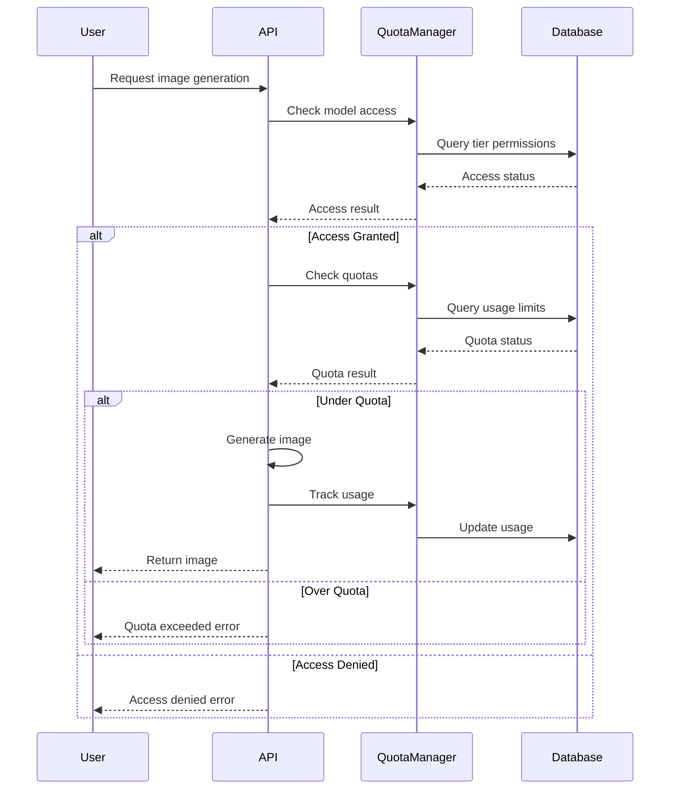

# Administrative Access Control & Quota Management System

## Overview

This system provides comprehensive administrative controls for managing user access to AI image generation models and enforcing quota limits. It includes a flexible tier-based system that allows fine-grained control over which models users can access and how many images they can generate.

## Features

### 1. User Tier Management
- **Flexible Tier System**: Create custom user tiers (e.g., free, premium, enterprise)
- **Automatic Tier Assignment**: Users are automatically assigned tiers based on their subscription status
- **Dynamic Tier Updates**: Administrators can change user tiers in real-time

### 2. Model Access Control
- **Per-Tier Model Access**: Control which AI models each user tier can access
- **Provider Support**: Support for multiple AI providers (Fal AI, OpenAI, Replicate, etc.)
- **Model Metadata**: Store model descriptions, parameters, and provider information

### 3. Quota Management
- **Multi-Level Limits**: Set hourly, daily, and monthly generation limits
- **Per-Model Quotas**: Different limits for different models
- **Real-Time Tracking**: Track usage in real-time with automatic limit enforcement

### 4. Usage Analytics
- **Detailed Tracking**: Monitor image generation across all users and models
- **Historical Data**: Track usage patterns over time
- **Administrative Insights**: View usage statistics and trends

## Database Schema

### Core Tables

#### `user_tiers`
Defines available user tiers and their properties.

```sql
CREATE TABLE user_tiers (
  id UUID PRIMARY KEY,
  name TEXT UNIQUE NOT NULL,
  display_name TEXT NOT NULL,
  description TEXT,
  is_active BOOLEAN DEFAULT TRUE,
  created_at TIMESTAMP,
  updated_at TIMESTAMP
);
```

#### `image_models`
Stores information about available AI models.

```sql
CREATE TABLE image_models (
  id UUID PRIMARY KEY,
  model_id TEXT UNIQUE NOT NULL,
  display_name TEXT NOT NULL,
  description TEXT,
  provider TEXT NOT NULL,
  is_active BOOLEAN DEFAULT TRUE,
  default_parameters JSONB DEFAULT '{}',
  created_at TIMESTAMP,
  updated_at TIMESTAMP
);
```

#### `tier_model_access`
Controls which models each tier can access.

```sql
CREATE TABLE tier_model_access (
  id UUID PRIMARY KEY,
  tier_id UUID REFERENCES user_tiers(id),
  model_id UUID REFERENCES image_models(id),
  is_enabled BOOLEAN DEFAULT TRUE,
  created_at TIMESTAMP,
  UNIQUE(tier_id, model_id)
);
```

#### `quota_limits`
Defines generation limits for each tier-model combination.

```sql
CREATE TABLE quota_limits (
  id UUID PRIMARY KEY,
  tier_id UUID REFERENCES user_tiers(id),
  model_id UUID REFERENCES image_models(id),
  daily_limit INTEGER DEFAULT 3,
  monthly_limit INTEGER DEFAULT 90,
  hourly_limit INTEGER DEFAULT 1,
  created_at TIMESTAMP,
  updated_at TIMESTAMP,
  UNIQUE(tier_id, model_id)
);
```

#### `usage_tracking`
Tracks actual usage for quota enforcement.

```sql
CREATE TABLE usage_tracking (
  id UUID PRIMARY KEY,
  user_id UUID REFERENCES profiles(id),
  model_id UUID REFERENCES image_models(id),
  images_generated INTEGER DEFAULT 1,
  date DATE DEFAULT CURRENT_DATE,
  hour INTEGER DEFAULT EXTRACT(HOUR FROM NOW()),
  created_at TIMESTAMP,
  UNIQUE(user_id, model_id, date, hour)
);
```

## API Endpoints

### Access Control API (`/api/admin/access-control`)

#### GET Parameters
- `type=tiers` - Get all user tiers
- `type=models` - Get all image models
- `type=access` - Get tier-model access permissions
- `type=quotas` - Get quota limits
- `type=usage` - Get usage analytics

#### POST Actions
- `update_tier_access` - Update model access for a tier
- `update_quota` - Update quota limits
- `create_tier` - Create new user tier
- `create_model` - Add new image model
- `update_user_tier` - Change user's tier

### Usage Examples

```javascript
// Check if user has access to a model
const hasAccess = await quotaManager.checkModelAccess(userId, 'fal-ai/flux/pro')

// Check quota before generation
const quotaCheck = await quotaManager.checkQuota(userId, 'fal-ai/flux/pro')
if (!quotaCheck.allowed) {
  throw new Error(`Quota exceeded: ${quotaCheck.reason}`)
}

// Track usage after generation
await quotaManager.trackUsage(userId, 'fal-ai/flux/pro', imageCount)
```

## Setup Instructions

### 1. Database Setup

Run the migration script to set up the required tables:

```bash
# Execute the SQL migration
psql -h your-db-host -d your-db-name -f scripts/02-admin-access-control.sql
```

### 2. Admin Configuration

Update your admin configuration to include admin emails:

```typescript
// lib/admin-config.ts
export const ADMIN_EMAILS = [
  'admin@yourcompany.com',
  'manager@yourcompany.com'
]
```

### 3. Environment Variables

Ensure you have the required environment variables:

```env
NEXT_PUBLIC_SUPABASE_URL=your-supabase-url
NEXT_PUBLIC_SUPABASE_ANON_KEY=your-supabase-anon-key
FAL_KEY=your-fal-ai-key
```

### 4. Update RLS Policies

Update the admin email list in your RLS policies:

```sql
-- Update policies to include your admin emails
CREATE POLICY "Admins can manage user tiers" ON public.user_tiers FOR ALL 
  USING (auth.jwt() ->> 'email' IN (
    SELECT unnest(string_to_array('your-admin@email.com,another-admin@email.com', ','))
  ));
```

## Default Configuration

### User Tiers
- **Free**: Limited access to basic models, 3 images/day
- **Premium**: Access to all models, 100 images/day
- **Admin**: Full access, 1000 images/day

### Default Models
- `fal-ai/fast-sdxl` - Fast Stable Diffusion XL
- `fal-ai/ideogram/v2` - Ideogram v2
- `fal-ai/ideogram/v3` - Ideogram v3
- `fal-ai/flux/schnell` - Flux Schnell
- `fal-ai/flux/dev` - Flux Dev

## Usage Workflow

### 1. Image Generation Request


### 2. Admin Management
1. **Access Admin Dashboard**: Navigate to `/admin`
2. **Select Access Control Tab**: Choose "Access Control & Quotas"
3. **Manage Permissions**: Use the interface to update tier access and quotas
4. **Monitor Usage**: View real-time usage analytics

## Security Considerations

### Row Level Security (RLS)
- All admin tables use RLS with admin-only policies
- User data is protected with user-specific policies
- Admin access is verified via JWT email claims

### Input Validation
- All API inputs are validated before database operations
- SQL injection protection through parameterized queries
- Rate limiting on admin endpoints

### Error Handling
- Graceful degradation when database is unavailable
- Detailed logging for debugging without exposing sensitive data
- User-friendly error messages

## Testing

### Unit Tests
Run the comprehensive test suite:

```bash
npm test __tests__/admin-quota-system.test.ts
```

### Integration Tests
Test the complete workflow:

```bash
npm run test:integration
```

### Performance Tests
Monitor system performance under load:

```bash
npm run test:performance
```

## Monitoring and Maintenance

### Key Metrics to Monitor
- **Quota Utilization**: Track usage patterns across tiers
- **Model Popularity**: Monitor which models are most used
- **Error Rates**: Watch for access control failures
- **Performance**: Monitor API response times

### Regular Maintenance Tasks
1. **Clean Old Usage Data**: Archive usage data older than 1 year
2. **Update Model Lists**: Add new models as they become available
3. **Review Quotas**: Adjust limits based on usage patterns
4. **Audit Admin Access**: Regularly review admin user list

### Troubleshooting

#### Common Issues

**Users Can't Generate Images**
1. Check user tier assignment in profiles table
2. Verify tier has access to requested model
3. Check quota limits and current usage
4. Review error logs for specific error messages

**Admin Interface Not Loading**
1. Verify admin email is in ADMIN_EMAILS list
2. Check database connectivity
3. Ensure RLS policies are correctly configured
4. Review browser console for JavaScript errors

**Quota Not Enforcing**
1. Check usage_tracking table for correct data
2. Verify quota_limits table has correct values
3. Test QuotaManager functions independently
4. Check for race conditions in concurrent requests

## Performance Optimization

### Database Optimization
- Index frequently queried columns
- Use connection pooling
- Implement query result caching
- Regular VACUUM and ANALYZE operations

### Application Optimization
- Cache quota check results for short periods
- Batch usage tracking updates
- Implement request deduplication
- Use database functions for complex queries

## Future Enhancements

### Planned Features
- **Dynamic Pricing**: Adjust costs based on model and tier
- **Usage Alerts**: Notify users approaching limits
- **Bulk Operations**: Mass user tier updates
- **Advanced Analytics**: Detailed usage reports and insights
- **API Rate Limiting**: Granular API access controls
- **Model Scheduling**: Time-based model availability

### Integration Opportunities
- **Payment Systems**: Automatic tier upgrades
- **External Analytics**: Export usage data
- **Notification Systems**: Real-time alerts
- **Audit Logging**: Comprehensive admin action logs

## Support

For technical support or questions about the admin system:

1. Check this documentation first
2. Review the error logs in the admin interface
3. Test individual components using the provided test suite
4. Contact the development team with specific error details

## Changelog

### Version 1.0.0
- Initial implementation of tier-based access control
- Basic quota management with hourly/daily/monthly limits
- Administrative interface for managing permissions
- Real-time usage tracking and enforcement
- Comprehensive test suite and documentation 