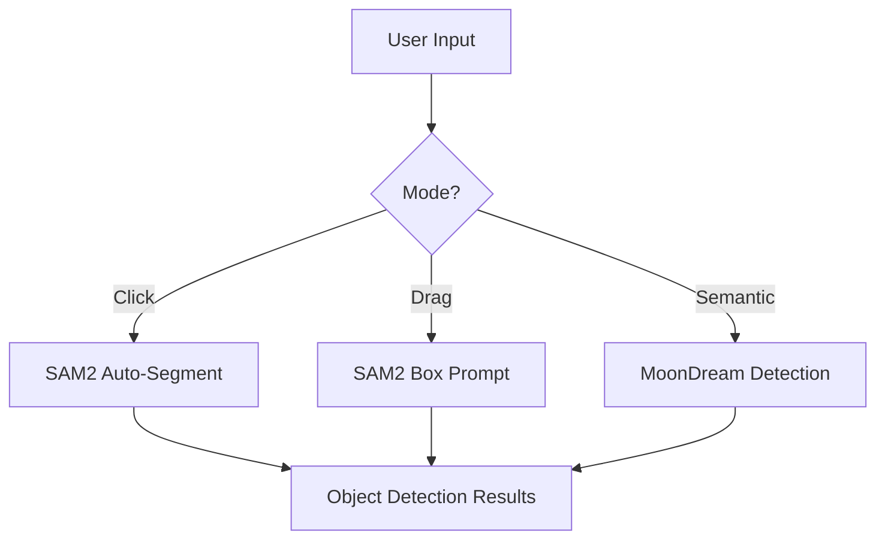
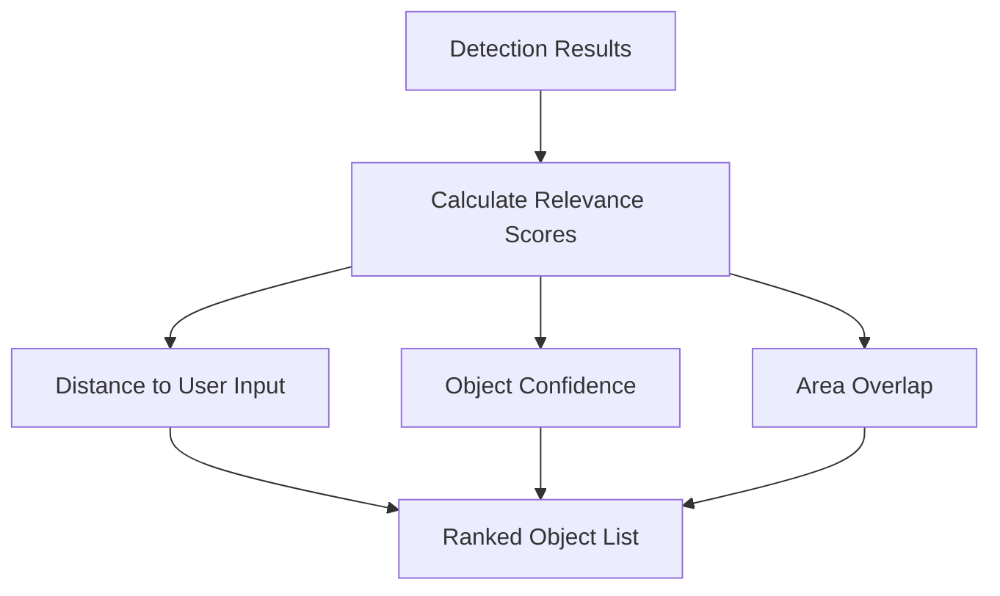
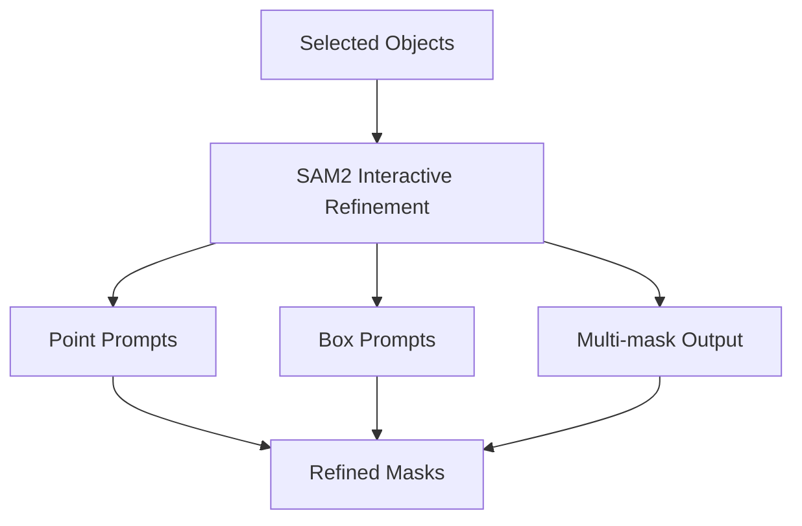
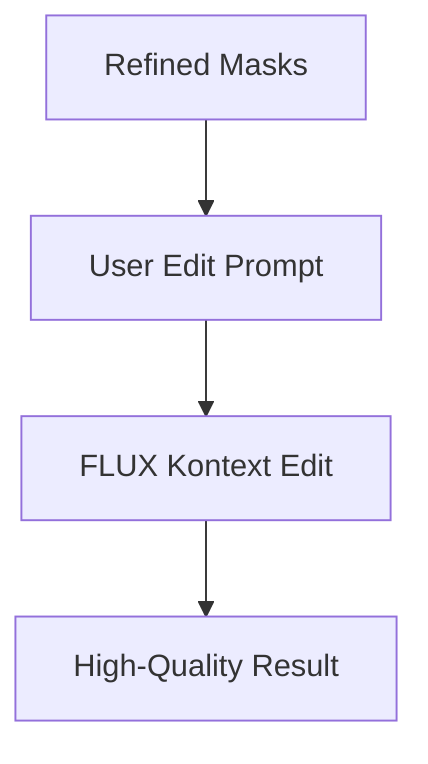

# Auto Lasso Tool Implementation Guide

## Overview

The Auto Lasso tool provides intelligent object selection and boundary detection for precise image editing. It combines multiple AI models to automatically detect object boundaries and refine selections based on user input.

## Architecture

### Core Components

1. **AutoLassoEditor Component** (`components/dashboard/auto-lasso-editor.tsx`)
   - User interface for auto lasso functionality
   - Multiple selection modes (click, drag, semantic)
   - Real-time object detection and refinement
   - Integration with editing operations

2. **Auto Lasso API** (`app/api/auto-lasso-segment/route.ts`)
   - Backend processing for object detection
   - Combines SAM2 and semantic detection
   - Smart object selection algorithms
   - Boundary refinement capabilities

### AI Models Integration

#### Primary Models
- **SAM2 Auto-Segment** (`fal-ai/sam2/auto-segment`)
  - Automatic object segmentation
  - High-quality mask generation
  - No user prompts required

- **SAM2 Interactive** (`fal-ai/sam2`)
  - Point/box-based refinement
  - User-guided selection improvement
  - Multi-mask output for best results

- **Florence-2 Object Detection** (`fal-ai/florence-2-large/object-detection`)
  - Semantic object recognition with meaningful labels
  - Automatic object classification (e.g., "person", "car", "tree")
  - High-accuracy bounding box detection

- **MoonDream Detection** (`fal-ai/moondream-next/detection`)
  - Semantic object understanding
  - Natural language object queries
  - Bounding box detection

#### Editing Models
- **FLUX Kontext** (`fal-ai/flux-pro/kontext`)
  - High-quality inpainting
  - Context-aware editing
  - Mask-based operations

- **FLUX Fill** (`fal-ai/flux-lora-fill`)
  - Advanced mask filling
  - LoRA support for style consistency
  - Commercial-grade quality

## Auto Lasso Modes

### 1. Smart Click Mode
**User Experience:**
- User clicks roughly on object
- AI automatically detects precise boundaries
- Instant feedback with refined selection

**Technical Implementation:**
```typescript
// 1. Use Florence-2 for semantic object detection
const semanticDetections = await florence2Detect(image)

// 2. Use SAM2 auto-segment for precise boundaries
const sam2Masks = await sam2AutoSegment(image)

// 3. Match SAM2 masks with Florence-2 labels
const labeledObjects = matchMasksToLabels(sam2Masks, semanticDetections)

// 4. Find closest object to user click
const targetObject = findClosestObject(labeledObjects, clickPoint)

// 5. Refine selection using SAM2 interactive
const refinedMask = await sam2Refine(image, clickPoint, targetObject.bbox)
```

### 2. Drag Area Mode
**User Experience:**
- User drags to select area
- AI finds objects within area
- Automatic boundary refinement

**Technical Implementation:**
```typescript
// 1. Use drag area as initial bounding box
const initialBox = userDragArea

// 2. Apply SAM2 with box prompt
const segmentation = await sam2Segment(image, { boxes: [initialBox] })

// 3. Refine based on object detection within area
const refinedObjects = filterObjectsInArea(segmentation, initialBox)
```

### 3. Semantic Mode
**User Experience:**
- User types what they want to select (e.g., "person", "car")
- AI finds all instances of that object type
- User selects from detected objects

**Technical Implementation:**
```typescript
// 1. Use MoonDream for semantic detection
const detections = await moondreamDetect(image, semanticPrompt)

// 2. Convert detections to SAM2 prompts
const sam2Prompts = detections.map(d => ({ boxes: [d.bbox] }))

// 3. Generate precise masks for each detection
const masks = await Promise.all(
  sam2Prompts.map(prompt => sam2Segment(image, prompt))
)
```

## Workflow Pipeline

### Stage 1: Initial Detection


### Stage 2: Smart Selection


### Stage 3: Boundary Refinement


### Stage 4: Editing Application


## Key Features

### Intelligent Object Detection
- **Automatic Segmentation**: No manual selection required
- **Semantic Labeling**: Objects automatically identified with meaningful names using Florence-2
- **Semantic Understanding**: Natural language object queries
- **Multi-object Support**: Detect and select multiple objects
- **Confidence Scoring**: Prioritize high-quality detections

### Boundary Refinement
- **Edge Snapping**: Automatic boundary adjustment
- **Multi-scale Analysis**: Works on objects of any size
- **Context Awareness**: Considers surrounding objects
- **Quality Optimization**: Multiple mask candidates

### User Experience
- **Instant Feedback**: Real-time selection visualization
- **Progressive Enhancement**: Rough selection → precise boundaries
- **Multiple Interaction Modes**: Click, drag, or semantic input
- **Undo/Redo Support**: Non-destructive workflow

## Implementation Benefits

### For Users
1. **Faster Workflow**: Reduce selection time by 80%
2. **Higher Accuracy**: AI-powered precision
3. **Easier Learning Curve**: Intuitive interaction
4. **Professional Results**: Commercial-quality output

### For Developers
1. **Modular Architecture**: Easy to extend and maintain
2. **Fallback Systems**: Graceful degradation
3. **Performance Optimized**: Efficient API usage
4. **Well Documented**: Clear implementation guide

## Usage Examples

### Basic Object Selection
```typescript
// Click mode - select person in photo
const result = await autoLassoSegment({
  image_url: imageUrl,
  mode: 'click',
  user_point: { x: 250, y: 300 }
})

// Apply edit
await editObject({
  image_url: imageUrl,
  mask_url: result.selected_objects[0].mask_url,
  prompt: "Change shirt color to blue"
})
```

### Area-based Selection
```typescript
// Drag mode - select objects in area
const result = await autoLassoSegment({
  image_url: imageUrl,
  mode: 'area',
  user_area: { x1: 100, y1: 100, x2: 400, y2: 300 }
})
```

### Semantic Selection
```typescript
// Semantic mode - find all cars
const result = await autoLassoSegment({
  image_url: imageUrl,
  mode: 'semantic',
  semantic_prompt: "car"
})
```

## Performance Considerations

### Optimization Strategies
1. **Caching**: Store SAM2 embeddings for reuse
2. **Batching**: Process multiple objects together
3. **Progressive Loading**: Show results as they become available
4. **Quality Thresholds**: Filter low-confidence detections

### Resource Management
- **Memory Efficient**: Stream processing for large images
- **API Rate Limiting**: Respect fal.ai quotas
- **Error Handling**: Graceful fallbacks
- **Timeout Management**: Prevent hanging requests

## Future Enhancements

### Planned Features
1. **Video Support**: Auto lasso for video editing
2. **Batch Processing**: Multiple images at once
3. **Custom Models**: User-trained object detection
4. **Real-time Collaboration**: Multi-user editing

### Advanced Capabilities
1. **3D Object Detection**: Depth-aware selection
2. **Temporal Consistency**: Video object tracking
3. **Style Transfer**: Maintain object style during edits
4. **Automatic Composition**: AI-suggested improvements

## Getting Started

### Prerequisites
- fal.ai API key configured
- Supabase database setup
- Next.js project structure

### Installation
1. Add the AutoLassoEditor component to your dashboard
2. Deploy the auto-lasso-segment API endpoint
3. Configure model permissions in your quota system
4. Test with sample images

### Configuration
```typescript
// Adjust detection sensitivity
const config = {
  confidence_threshold: 0.8,
  refine_selection: true,
  max_objects: 10,
  timeout_ms: 30000
}
```

This implementation provides a professional-grade auto lasso tool that significantly improves the image editing workflow while maintaining high quality results. 